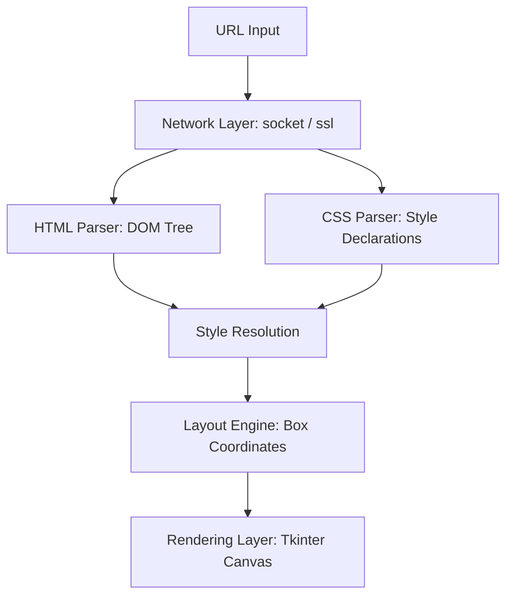

# Design Document: Prowser

Prowser is a simple web browser implemented in Python using the standard library.

## Architecture Overview

Prowser operates in five stages:
1. **Network**: Fetch the web page via HTTP or HTTPS using raw sockets.
2. **HTML Parsing**: Parse HTML source into a DOM (Document Object Model) tree.
3. **CSS Parsing**: Parse CSS stylesheets and compute style rules for DOM elements.
4. **Layout**: Generate a layout tree (composed of block and inline boxes) and calculate positions.
5. **Rendering**: Draw layout boxes onto a graphical canvas using Tkinter.

## Detailed Component Specifications

### 1. Network Layer (`network.py`)
Provides a function to make HTTP and HTTPS requests.
- Parses the URL (host, port, path).
- Establishes a TCP socket connection.
- Wraps the socket in an SSL context for HTTPS requests.
- Sends a GET request with standard headers (`Host`, `Connection: close`, `User-Agent`).
- Parses the response status line, headers, and body.
- Supports automatic redirection on 301, 302, 307, and 308 response codes.

### 2. Document Object Model (`html_parser.py`)
Represents the page structure.
- `Node`: Base class for DOM nodes. Holds parent and children pointers.
- `Element`: Represents HTML tags. Stores tag name and attribute dictionary.
- `Text`: Represents plain text content.
- `HTMLParser`: Parses source code using a state machine (text state, tag state, attribute state). It constructs the DOM tree using a stack-based algorithm.

### 3. Style Rules & CSS Engine (`css_parser.py`)
Computes the styling for each DOM element.
- `CSSRule`: Contains a selector and a dictionary of declarations.
- Parsed properties include colors, margins, padding, and font properties.
- Style resolution applies selector rules in order of specificity and merges inline styles. Properties like color inherit from the parent node.

### 4. Layout Engine (`layout.py`)
Converts the styled DOM tree into a visual layout.
- `LayoutBox`: Base layout box. Has dimensions (x, y, width, height) and references a DOM node.
- `BlockLayout`: Represents block-level tags. Positions boxes vertically.
- `InlineLayout`: Represents inline tags and text. Positions boxes horizontally, wrapping text lines when they exceed parent width limits.
- Layout calculation is a multi-pass process: parents propagate widths down, children layout themselves and return heights, and parents set final heights.

### 5. UI and Render Layer (`browser.py`)
Displays the UI and handles user inputs.
- Extends the Tkinter framework.
- Layout boxes are translated into canvas draw commands (`create_text`, `create_rectangle`).
- Handles mouse scrolling and scrollbar actions.
- Listens for clicks. If a click target is inside an anchor element, the browser requests the new URL.
